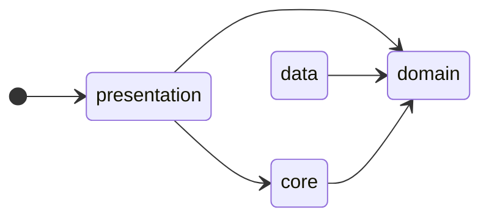
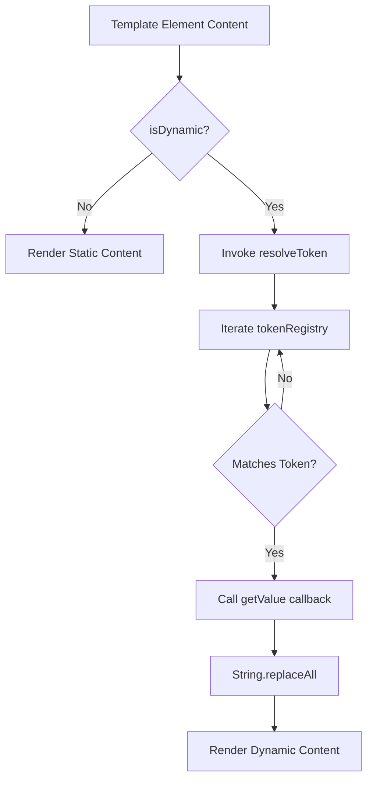
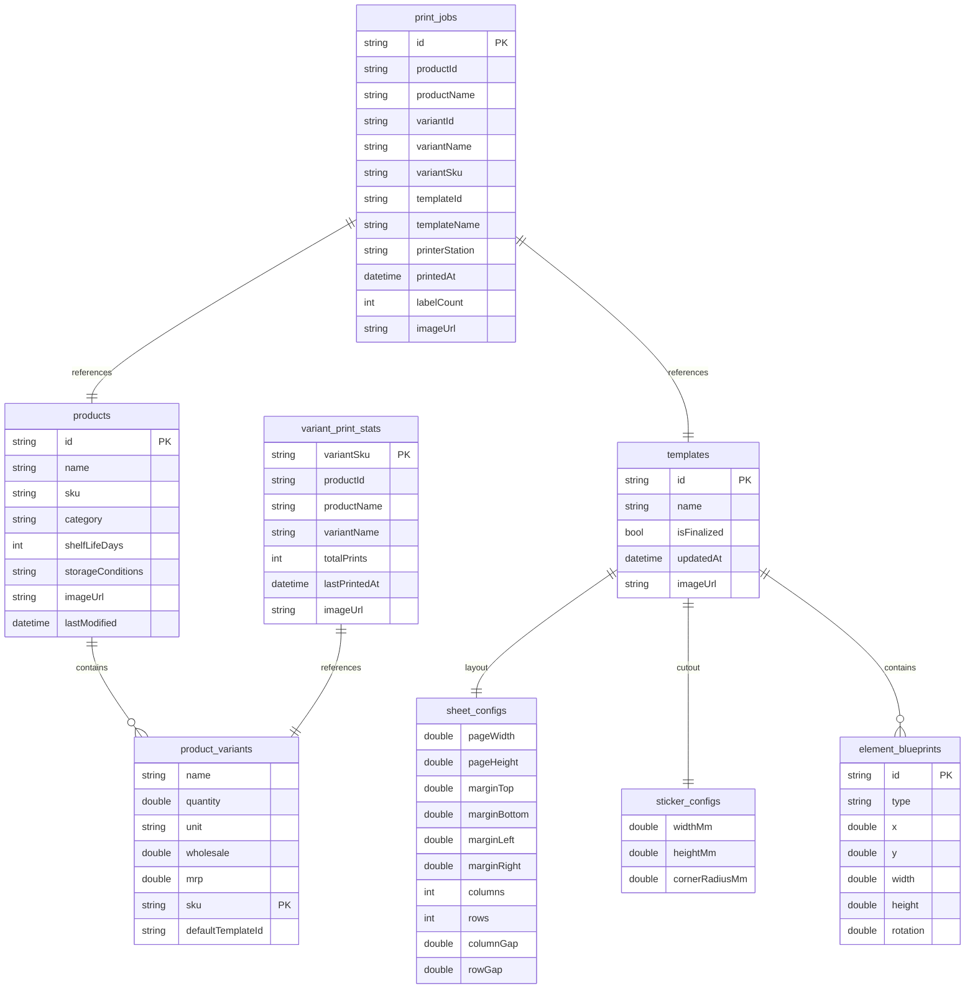
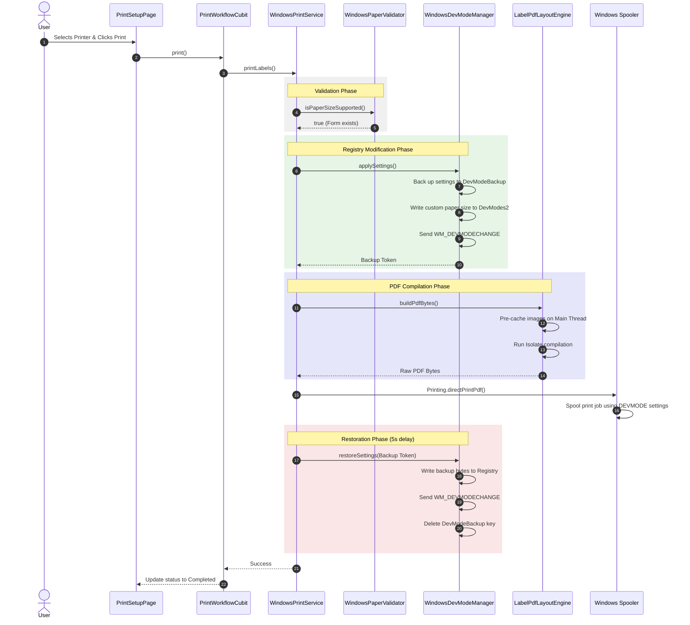

# Stickify — Current System Architecture & Precision Printing Engine

This document provides a comprehensive, deep-dive architectural analysis of the **Stickify** application (also known as **Label Grid**). It details the current design, layout math, PDF rendering pipeline, and Windows registry-level print pipelines. It is designed to enable a team to extend the printing engine, introduce printer calibration profiles, support multi-printer routing, and implement sub-millimeter layout alignment.

---

## 🏛️ 1. Project Overview

### Purpose of the Application
Stickify is a desktop-first Flutter application (also supporting mobile and web platforms) designed for packaging logistics managers and warehouse operators to design, manage, and print adhesive sticker labels. It features a visual template designer, a product/variant catalog catalog, search interfaces, and a precision printing pipeline.

### Main Business Workflows & User Journey
1. **Cataloging**: Administrators define products and variant packaging specs (e.g. weight, volume, wholesale/retail pricing, ingredients, and nutrition facts).
2. **Template Creation**: Designers define physical sheet dimensions (e.g. A4 sheet, custom rolls) and sticker cuts (width, height, corner radius, printable area polygon).
3. **Label Design**: Designers use a drag-and-drop editor to place text fields (static or dynamic variables), shapes, barcodes, QR codes, images, and nutrition tables.
4. **Job Configuration**: Operators select a product variant and template, specify print quantities, preview sheet layouts, and tap grid slots to skip/disable used spaces on partially-printed sheets.
5. **Precision Printing**: The application compiles the custom layout into PDF pages and dispatches them via platform-specific print pipelines (native Windows `winspool.drv` registry overrides vs. standard system print dialogs).

### High-Level System Architecture
Stickify follows **Clean Architecture** patterns, ensuring business rules are decoupled from UI and framework layers:
- **Domain Layer (`lib/domain/`)**: Contains pure business entities, repository interfaces, and core service contracts (no external framework code).
- **Data Layer (`lib/data/`)**: Implements repositories and services, integrating local caching (Hive CE), cloud sync (Cloud Firestore), user authorization (Firebase Auth), and filesystem tasks.
- **Core Layer (`lib/core/`)**: Includes platform-specific modules (Windows printing), PDF element strategies, common utility calculations, logging, and environment configurations.
- **Presentation Layer (`lib/presentation/`)**: Contains BLoC state managers, responsive layouts (Tablet, Desktop, Mobile), screen navigators (GoRouter), and visual canvases.

```mermaid
graph TD
    subgraph Presentation Layer
        A[UI Screens / Views] --> B[BLoC / Cubit State]
        B --> C[Editor Canvas / Print Preview]
    end

    subgraph Domain Layer (Entities & Interfaces)
        D[PrintService Interface]
        E[LabelLayoutEngine Interface]
        F[TemplateRepository Interface]
        G[Domain Entities: LabelTemplate, Product...]
    end

    subgraph Data Layer (Implementations)
        H[SyncingTemplateRepository] --> F
        I[HiveLocalDatabase]
        J[FirestoreRemoteDatabaseService]
        H --> I
        H --> J
    end

    subgraph Core Layer (System & Platform Services)
        K[WindowsPrintService] --> D
        L[PdfPrintService] --> D
        M[LabelPdfLayoutEngine] --> E
        N[WindowsDevModeManager]
        O[WindowsPaperValidator]
        K --> N
        K --> O
        K --> M
        L --> M
    end

    A --> B
    B --> D
    B --> F
    I -.-> G
    J -.-> G
```

### Module Dependency Diagram


### Technology Stack & Important Third-Party Libraries
- **Language & SDK**: Dart 3.12.0 / Flutter 3.44.1
- **State Management**: `flutter_bloc` (^9.1.1)
- **Routing**: `go_router` (^17.3.0) + `go_router_builder` (^4.3.0)
- **Local Persistence**: `hive_ce` (^2.19.3) + `hive_ce_flutter` (^2.3.4) for offline-first replication.
- **Cloud Backend**: `firebase_core` (^4.10.0), `firebase_auth` (^6.5.2), `cloud_firestore` (^6.5.0)
- **Document Sizing & Printing**: `pdf` (^3.12.0) and `printing` (^5.14.3)
- **Barcode Engines**: `barcode_widget` (^2.0.4)
- **Responsive System**: `responsive_framework` (^1.5.1)

---

## 📐 2. Template System Analysis

### Template Definition & Storage Format
Templates are defined in the domain entity [LabelTemplate](file:///g:/GitHub/stickify/lib/domain/entities/label_template.dart) and locally stored in Hive box `'templates'` via [LabelTemplateHiveModel](file:///g:/GitHub/stickify/lib/data/models/hive/template_hive_model.dart). 
- **Storage structure**: Hierarchical document model containing layout configurations ([SheetConfig](file:///g:/GitHub/stickify/lib/domain/entities/sheet_config.dart)), sticker specifications ([StickerConfig](file:///g:/GitHub/stickify/lib/domain/entities/sticker_config.dart)), and list arrays of design objects ([ElementBlueprint](file:///g:/GitHub/stickify/lib/domain/entities/editor/element_blueprint.dart)).
- **Remote replication**: Serialized to JSON maps via [TemplateFirestoreModel](file:///g:/GitHub/stickify/lib/data/models/firestore/template_firestore_model.dart) and stored in Cloud Firestore under document path: `users/$userId/templates/$templateId`.
- **Versioning & Lifecycles**: Checked out as draft templates in the template list. Modifications updates `updatedAt` timestamps. Marking `isFinalized = true` locks the template configuration, releasing it to the operator print setup page.

### Coordinate System & Scaling Formulas
Stickify maintains a strict **millimeter-first layout engine** internally to guarantee that designs are completely resolution-independent.
- **Internal Units**: Physical millimeters (mm).
- **Origin point (0,0)**: The top-left corner of the individual sticker.
- **UI Screen Scaling**: Translated from physical millimeters to screen pixels by multiplying by the scale factor `AppDimensions.mmToPx = 4.0` and the user's `zoomLevel`.
  $$\text{Screen Pixels} = \text{Millimeters} \times 4.0 \times \text{ZoomLevel}$$
- **UI Event Conversions**: Screen drag/resize delta offsets are converted back to millimeters before modifying the model properties:
  $$\Delta \text{Millimeters} = \frac{\Delta \text{Screen Pixels}}{4.0 \times \text{ZoomLevel}}$$
- **PDF Unit Conversions**: The `pdf` library uses **PostScript Points** (1/72 of an inch). Sizing conversions multiply physical millimeters by the scale constant `PdfPageFormat.mm` (approximately `2.83464567` points per mm):
  $$\text{PDF Points} = \text{Millimeters} \times \text{PdfPageFormat.mm}$$
- **Precision Limits**: Persistent coordinates use `double` data types. Spooler devmode overrides use values rounded to the nearest $0.1\text{ mm}$ (Int16 tenths of millimeter).

### Template Objects (Supported Elements)
Every design component inherits from [ElementBlueprint](file:///g:/GitHub/stickify/lib/domain/entities/editor/element_blueprint.dart):

| Object Type | Data Model | Sizing & Positioning | Rendering & Font Handling | Overflow & Rules |
| :--- | :--- | :--- | :--- | :--- |
| **Text Field** | [TextElementBlueprint](file:///g:/GitHub/stickify/lib/domain/entities/editor/text_element_blueprint.dart) | Bound box defined in mm. Clockwise rotation support. | TrueType font files loaded on startup (Arial-Regular, Arial-Bold). FontSize in points. | Clamped by `maxLines`. PDF uses `TextOverflow.clip`. UI uses `TextOverflow.ellipsis`. |
| **Shape** | [ShapeElementBlueprint](file:///g:/GitHub/stickify/lib/domain/entities/editor/shape_element_blueprint.dart) | Bound box defined in mm. Stroke width & corner radius in mm. | Vector rendering. Supports solid fill, custom borders, and rounded corners. | Scaled to match physical bounding box. |
| **Barcode** | [BarcodeElementBlueprint](file:///g:/GitHub/stickify/lib/domain/entities/editor/barcode_element_blueprint.dart) | Bounding box defined in mm. | Renders 1D barcodes via `barcode_widget` (supports `code128`, `ean13`). Optional dynamic text underneath. | Fails print job validation if barcode boundary crosses printable area polygon. |
| **QR Code** | [QrElementBlueprint](file:///g:/GitHub/stickify/lib/domain/entities/editor/qr_element_blueprint.dart) | Square bounding box in mm. | Renders 2D QR Code. | Fails print job validation if QR boundary falls outside printable area. |
| **Image** | [ImageElementBlueprint](file:///g:/GitHub/stickify/lib/domain/entities/editor/image_element_blueprint.dart) | Bounding box in mm. | Strategy handles local path, network URL, or Flutter asset bytes. BoxFit rules apply. | Renders grey placeholder if image bytes fail to load. |
| **Nutrition Table** | [NutritionTableElementBlueprint](file:///g:/GitHub/stickify/lib/domain/entities/editor/nutrition_table_element_blueprint.dart) | Bounding box in mm. | Draws standardized FDA Nutrition Facts table grid. | Table is compiled at 240x320 points, and scaled to the box size via `FittedBox`. |

### Layout Engine
- **Element Overlaps**: Elements are rendered inside a `Stack` (in both UI and PDF). Overlapping is permitted.
- **Layering (Z-Index)**: Determined by the index order in `LabelTemplate.elements` list. Elements declared later render on top of previous elements (Painter's algorithm).
- **Safe Areas & Safe Cut Boundaries**: The individual sticker boundary is configured via `StickerConfig.printableArea` (ordered polygon vertices). The canvas paints this boundary in red. Pre-print validation checks containment using a ray-casting point-in-polygon algorithm.
- **Polygon Clipping**: Non-rectangular stickers (circles, ovals, shapes) use the printable area path to crop compiled sticker elements in the PDF document via `canvas.clipPath()` inside a `pw.CustomPaint`. PDF Y-axis values are flipped to match the bottom-left origin: `pdfY = (heightMm - localY) * PdfPageFormat.mm`.

---

## 🔗 3. Data Binding / Variable Replacement

Stickify binds real-time database fields into label templates at print time.

### Placeholder Syntax & Data Sources
- **Syntax**: Double-mustache curly braces, e.g., `{{product.name}}`, `{{variant.sku}}`.
- **Data Sources**: Evaluated using product catalog documents, variant packaging specifications, and system metadata.
- **System Computed Tokens**: Centralized in [token_registry.dart](file:///g:/GitHub/stickify/lib/core/utils/token_registry.dart):
  - `{{system.mfg_date}}`: Today's date, formatted as `DD-MM-YYYY`.
  - `{{system.batch_number}}`: Weekly tracking code formatted as `W[WeekNumber]Y[Year]` (e.g. `W26Y2026`).
  - `{{system.expiry_date}}`: Dynamically computed as `MFG Date + product.shelfLifeDays`.
  - `{{product.ingredients}}`: Automatically builds a comma-separated list of ingredients sorted by percentage.
  - `{{product.nutrition.calories}}`: Calorie counts.

### Variable Evaluation & Runtime Replacement Flow
1. During PDF compilation or canvas preview rendering, elements marked as `isDynamic` are parsed.
2. The renderer invokes `TextElementRenderer.resolveToken(blueprint.content, product, variant)`.
3. It iterates over the registered list of [TemplateToken](file:///g:/GitHub/stickify/lib/core/utils/token_registry.dart) objects.
4. If a token string matches, the callback `tokenDef.getValue(product, variant)` calculates the runtime value.
5. The placeholder is replaced via String substitution (`replaceAll(token, value)`).



- **Type Conversion & Formatting**:
  - Currency prices (MRP, wholesale, unitPrice) format using `toStringAsFixed(2)`.
  - Double quantities with integer values truncate decimals (e.g., `10.0` becomes `10`).
  - Dates format in `DD-MM-YYYY` using pad-left character formatting.
- **Missing Value Handling**: Fallbacks default to empty strings (`''`) to ensure templates do not render raw brackets.
- **Error Handling**: If a barcode fails to bind data, a fallback text is used (`'12345678'`) to prevent printing crashes.

---

## 🌊 4. Rendering Pipeline

The printing lifecycle transitions from template configurations to physical sheets of paper through a structured pipeline:

```
               Template Design (LabelTemplate)
                              │
                              ▼
           Data Injection (Token Binding Engine)
                              │
                              ▼
            Layout Calculation (Grid Reflow Math)
                              │
                              ▼
        Isolate Rendering (Strategy Pattern Drawing)
                              │
                              ▼
              PDF Compilation (Document Saving)
                              │
                              ▼
        Registry DEVMODE Overrides (Windows Spooler)
                              │
                              ▼
                 Physical Paper (Print Job)
```

### Detailed Pipeline Stages

#### 1. Input Configuration
- **Input**: User-selected [Product](file:///g:/GitHub/stickify/lib/domain/entities/product.dart), [ProductVariant](file:///g:/GitHub/stickify/lib/domain/entities/product_variant.dart), [LabelTemplate](file:///g:/GitHub/stickify/lib/domain/entities/label_template.dart), print `quantity`, `printFromBottom` flag, and a list of disabled slots (`disabledSlots`).
- **Output**: Validated blueprint schema, image caches, and configuration dimensions.

#### 2. Data Injection
- **Classes Involved**: [TextElementRenderer](file:///g:/GitHub/stickify/lib/presentation/features/template_editor/renderers/text_element_renderer.dart) & [tokenRegistry](file:///g:/GitHub/stickify/lib/core/utils/token_registry.dart).
- **Transformations**: String templates are evaluated, translating placeholder tokens into formatted text, pricing strings, or dynamic URLs.

#### 3. Layout Grid Calculation
- **Classes Involved**: [LabelPdfLayoutEngine](file:///g:/GitHub/stickify/lib/core/services/printing/label_pdf_layout_engine.dart).
- **Transformations**:
  - Grid cell indexes are computed: `slotsPerSheet = columns * rows`.
  - Determines total sheets needed, skipping indices listed in `disabledSlots`.
  - Grid slot offsets in mm are mapped to physical page coordinates:
    $$X_{\text{slot}} = \text{marginLeft} + c \times (\text{widthMm} + \text{columnGap}) + \text{shiftX}$$
    $$Y_{\text{slot}} = \text{marginTop} + r \times (\text{heightMm} + \text{rowGap}) + \text{shiftY}$$

#### 4. Element Rendering Strategy
- **Classes Involved**: [PdfElementRendererRegistry](file:///g:/GitHub/stickify/lib/core/services/pdf/pdf_element_renderer_registry.dart) and concrete renderer subclasses.
- **Transformations**: Translates layout blueprints into PDF widgets (`pw.Widget`), scaling size values from millimeters to PDF points by multiplying with `PdfPageFormat.mm`.

#### 5. Isolate PDF Generation
- **Classes Involved**: [LabelPdfLayoutEngine](file:///g:/GitHub/stickify/lib/core/services/printing/label_pdf_layout_engine.dart) / `Isolate.run()`.
- **Transformations**: A background isolate constructs `pw.Document`, generates pages containing stack-positioned sticker widgets, and compiles output bytes (`doc.save()`) to returning a `Uint8List`.

#### 6. Print Spooling
- **Classes Involved**: [WindowsPrintService](file:///g:/GitHub/stickify/lib/core/services/printing/windows/windows_print_service.dart) (or [PdfPrintService](file:///g:/GitHub/stickify/lib/core/services/pdf_print_service.dart)).
- **Transformations**: Modifies registry settings to override print dimensions, calls `Printing.directPrintPdf` to bypass native print dialogue prompt screens, and releases the execution mutex after restoring configurations.

---

## 📄 5. PDF Generation System

### PDF Library
- **Library**: `pdf` (^3.12.0) and `pdf/widgets.dart` as `pw`.
- **Configuration**: Dynamic compression enabled (`compress: true`) inside background isolates to minimize print file size.

### Page Setup
- **Page Size Handling**: Page dimensions are derived from `SheetConfig` and translated to points: `pageWidth * PdfPageFormat.mm` $\times$ `pageHeight * PdfPageFormat.mm`.
- **Orientation**: If the spooled orientation is Portrait while the template layout width exceeds its height, `pw.PageOrientation.landscape` is applied to rotate the output page canvas.
- **Margins**: Set to `marginAll: 0` because margins and spacing are calculated manually to prevent driver shifting.
- **Bleed & Crop**: Not supported natively; coordinates match physical boundaries.

### Element PDF Rendering Details
- **Text**: Rendered using standard `pw.Text` widgets, using custom TrueType fonts.
- **Fonts**: Dynamic font file bytes are loaded using `rootBundle.load('assets/fonts/Arial-Regular.ttf')` and injected as `pw.Font.ttf()` to support Unicode character rendering.
- **Images**: Loaded into memory as raw bytes, cached in a `Map<String, Uint8List>` map, and rendered using `pw.Image(pw.MemoryImage(bytes))` using BoxFit rules.
- **Vector Graphics**: Rectangles and lines are rendered via `pw.Container` boxes using borders and background shapes.
- **Barcodes & QR Codes**: Standard vector barcode shapes are generated directly using `pw.BarcodeWidget` from the `pdf` package.

### PDF Output & File Lifecycle
- **Memory-first Generation**: PDF documents are generated in memory as `Uint8List` byte arrays.
- **No Temporary Files**: The bytes are sent directly to the printing spooler without writing files to local disk directories, minimizing write wear and security exposure.
- **Export Options**: Exporting files bypasses print pipelines, invoking the platform's native file saver to write binary data to user-selected folders.

---

## 🖨️ 6. Printing System Deep Analysis

### Printer Interaction APIs
- **Windows**: Interacts with print queues using `winspool.drv` DLL function overrides. The dynamic DLL interop is loaded into custom PowerShell scripts executed via `Process.run`.
- **Other Platforms**: Delegated to native print architectures (CUPS, AirPrint) via the `printing` package interface.

### Print Job Lifecycle
```
[User clicks Print]
       │
       ▼
[PrintWorkflowCubit.print()]
       │
       ▼
[WindowsPrintService.printLabels()] (Validates bounds, printable area)
       │
       ▼
[WindowsPaperValidator.isPaperSizeSupported()] (Check driver support via listPapers.ps1)
       │
       ▼
[WindowsDevModeManager.applySettings()] (Lock Mutex, apply Registry DevMode, broadcast change)
       │
       ▼
[Printing.directPrintPdf()] (Bypass OS dialog window)
       │
       ▼
[LabelPdfLayoutEngine.buildPdfBytes()] (Load fonts/images on main thread, compile PDF in isolate)
       │
       ▼
[Windows Print Spooler] (Ingests PDF bytes with registry overridden paper sizes)
       │
       ▼
[WindowsDevModeManager.restoreSettings()] (Wait 5s, restore original DevMode registry, release Mutex)
```

### Printer Configuration
- **Printer Listing**: Discovered dynamically via `Printing.listPrinters()`.
- **Paper Forms Integration**: On Windows, the printer's driver is checked for paper size configurations:
  - If a driver form matches the template within a `1.5 mm` tolerance, its `RawKind` ID is used.
  - If no form is matched, the print job is aborted with instructions to register the size in Print Server Properties.
- **Orientation**: Written to DEVMODE at offset 76 (`dmOrientation = 1` for Portrait). Custom landscape sizes swap width and length parameters in DEVMODE to match driver shapes, avoiding double rotation.
- **Copies & Settings**: Dispatched through spooler parameters in `Printing.directPrintPdf`.

### Current System Limitations
1. **Hardware Margins**: The application cannot detect the print head's physical margins. Zero-margin layouts on standard printers will crop content.
2. **Calibration System**: No X/Y coordinate calibration offsets or scaling corrections are currently supported.
3. **Landscape Shift Offset**: Landscape jobs on Windows experience a vertical alignment shift of ~5mm due to spooler margin subtraction. This is corrected via a hardcoded offset (`shiftY = format.marginTop`), but this logic is hardcoded for specific desktop printers.
4. **Coexistence of Jobs**: While sequential print jobs are queued using the mutex chain, parallel applications overriding the same registry values may cause devmode conflicts.

---

## 🔄 7. Coordinate Transformation Audit

Coordinates are transformed dynamically across different application layers:

```
[Template mm Coordinate]
           │
           ▼ (multiplied by 4.0 * zoomLevel)
[Editor Canvas UI Pixels]
           │
           ▼ (restored: divide by 4.0 * zoomLevel)
[Database Persisted mm]
           │
           ▼ (multiplied by PdfPageFormat.mm)
[PDF Document Points]
           │
           ▼ (Windows Spooler shift: slotY + format.marginTop for landscape)
[Printer Spooler Coordinates]
           │
           ▼ (0.1 mm precision rounding: mm * 10)
[DEVMODE Registry Units]
           │
           ▼
[Physical Paper Placement]
```

### Coordinate Modifications Summary
- **Millimeter to Canvas Pixels**: `mm * 4.0 * zoomLevel`.
- **Millimeter to PDF Points**: `mm * 2.83464567`.
- **Landscape Top Margin Shift**: Vertical coordinates are shifted inside `LabelPdfLayoutEngine`:
  $$Y_{\text{shifted}} = Y_{\text{calculated}} + \text{format.marginTop}$$
- **DEVMODE Page Size**: mm values are multiplied by 10 and written as Int16 values.

---

## 🗄️ 8. Database / Persistence Analysis

### Database Infrastructure
- **Type**: Hive Community Edition (`hive_ce`), a key-value database optimized for local Flutter environments.
- **Storage Location**: Hive box files reside in: `~/Documents/label-grid/database/`.

### Entity Relationship Model


- **Migrations**: No migration system is currently implemented. Changing model schemas requires clearing local databases or updating Hive adapters manually.
- **Indexes**: Hive stores keys in-memory, eliminating the need for explicit local indexes.

---

## ⚙️ 9. Configuration System

- **Global Configs**: Wired in the service locator [AppServiceLocator](file:///g:/GitHub/stickify/lib/app/app_service_locator.dart).
- **Registry Usage**: Windows registry paths:
  - `HKCU:\Printers\DevModes2`: Printer driver configurations.
  - `HKCU:\Printers\DevModePerUser`: User-specific printer configurations.
  - `HKCU:\Printers\DevModeBackup`: Recovery database for restoration after a crash.
- **Environment Variables**: No system environment variables are used; runtime targets are controlled via build configurations (Development, Staging, Production).

---

## 🛡️ 10. Error Handling and Logging

### Logging System
- **Logger API**: [Log](file:///g:/GitHub/stickify/lib/core/services/logging/logger_service.dart) static wrapper.
- **Composite Broadcasts**: Console output uses `developer.log`. File output is written using [FileLoggerService](file:///g:/GitHub/stickify/lib/core/services/logging/file_logger_service.dart).
- **Log Locations**:
  - Windows: `%APPDATA%\Inevitable Software Company\stickify\app.log`
  - macOS: `~/Library/Application Support/Inevitable Software Company/stickify/app.log`
  - Linux: `~/.local/share/stickify/app.log`
- **Rolling Strategy**: Files roll daily or when log size reaches 5 MB (keeps 5 historical files).
- **Exceptions interception**: Intercepts unhandled async errors (`PlatformDispatcher`), framework crashes (`FlutterError`), and state management errors (`AppBlocObserver`).

---

## ⚡ 11. Performance Analysis

### Performance Features
- **CPU Offloading**: The CPU-heavy task of generating PDF documents is offloaded to background isolates using `Isolate.run()`. This ensures the UI remains responsive (60fps) during document compilation.
- **Isolate Pre-Caching**: Network and local images are fetched on the main thread and sent to isolates as simple `Uint8List` byte maps, since Dart isolates cannot access native platform channels or directories.
- **Win32 Execution Mutex**: Mutex queues serialize DEVMODE updates, ensuring print jobs do not conflict when accessing registry settings.
- **Win32 Spooler Lock Delay**: A 5-second delay is introduced in `restoreSettings` to ensure the spooler locks the print job before original settings are restored, preventing document alignment errors.

---

## 🔍 12. Code Quality and Architectural Findings

### Strengths
1. **Millimeter-first Layout Engine**: Using physical units (mm) inside domain models ensures that layouts are independent of device screen sizes, zoom factors, or target DPI configurations.
2. **Strategy Pattern Renderers**: Strategies inside `PdfElementRendererRegistry` decouple template parsing from UI frameworks, simplifying support for new design objects.
3. **Robust Windows Corrections**: Registry overrides and horizontal alignment offsets correct systematic driver shifts.
4. **Self-Healing Registry Startup**: Healing logic (`healOnStartup()`) restores printer settings on startup if the application crashes.

### Technical Debt & Code Risks
- **No Coordinate Calibration**: The system cannot calibrate for mechanical paper feed variances, printer tray shifts, or rollers, which can throw physical print alignment off by 1–3mm.
- **Lack of Database Migration**: Local databases lack a schema migration system, which can cause model serialization errors when updating configurations.
- **Hardcoded Landscape Margin Offset**: The landscape offset `shiftY = format.marginTop` is hardcoded for specific printers, which may cause layout issues on other models.
- **Zero-Margin Layout Constraints**: The layout engine does not account for the unprintable margins of physical printers, which can result in clipped layouts.
- **Tight Registry Hooking**: The application modifies registry keys directly. If a print job is aborted or fails, other Windows programs may experience print errors until settings are restored.

---

## 🔮 13. Future Readiness Assessment

The architecture is rated below against planned features:

### 1. Multiple Templates (Ready)
- **Status**: **Ready**
- **Details**: The database, syncing models, and layouts natively support creating, editing, and using multiple templates per product or variant.

### 2. Multiple Printers (Ready)
- **Status**: **Ready**
- **Details**: The [PrintService](file:///g:/GitHub/stickify/lib/domain/services/print_service.dart) interface and screen workflows support querying, selecting, and routing jobs to multiple print devices.

### 3. Printer Calibration Profiles (Requires minor changes)
- **Status**: **Requires minor changes**
- **Details**: The system lacks a calibration structure. Implementing this feature will require updating the data model to persist offsets per printer, and adjusting the layout coordinates in the engines.

### 4. Advanced Printing Features (Requires refactoring)
- **Status**: **Requires refactoring**
- **Details**: Supporting advanced capabilities like paper tray selection, custom feed paths, zero-margin printing, or custom rotation will require expanding the `PrintService` contract and modifying the PowerShell registry override script.

---

## 📊 14. Visual Documentation

### Overall System Interaction Flow
This diagram details the sequence of calls from the UI layer down to the Windows Registry and Print Spooler:



---

## 🗃️ 15. Implementation Inventory

### Key Classes & Modules

| Module / Component | Responsibility | Files |
| :--- | :--- | :--- |
| **Print Service Interface** | Contract defining printer listing and document dispatch methods. | [print_service.dart](file:///g:/GitHub/stickify/lib/domain/services/print_service.dart) |
| **Windows Print Service** | Controls layout validations, paper form sizes, and spooling on Windows. | [windows_print_service.dart](file:///g:/GitHub/stickify/lib/core/services/printing/windows/windows_print_service.dart) |
| **DevMode Manager** | Manages Windows registry backups, DEVMODE overrides, and crash recovery. | [windows_devmode_manager.dart](file:///g:/GitHub/stickify/lib/core/services/printing/windows/windows_devmode_manager.dart) |
| **Paper Validator** | Queries system printer drivers to verify supported sheet dimensions. | [windows_paper_validator.dart](file:///g:/GitHub/stickify/lib/core/services/printing/windows/windows_paper_validator.dart) |
| **Layout Engine** | Offloads element parsing and PDF widget compilation to background isolates. | [label_pdf_layout_engine.dart](file:///g:/GitHub/stickify/lib/core/services/printing/label_pdf_layout_engine.dart) |
| **PDF Renderer Registry** | Maps layout blueprint elements to their corresponding PDF rendering strategies. | [pdf_element_renderer_registry.dart](file:///g:/GitHub/stickify/lib/core/services/pdf/pdf_element_renderer_registry.dart) |
| **Local Database** | Local persistence wrapper powered by Hive CE database engine. | [hive_local_database.dart](file:///g:/GitHub/stickify/lib/data/services/hive_local_database.dart) |
| **Sync Queue** | Local queue holding pending database updates for remote syncing. | [hive_sync_queue.dart](file:///g:/GitHub/stickify/lib/data/services/hive_sync_queue.dart) |

### Important Methods

| Method Name | Purpose | Location |
| :--- | :--- | :--- |
| `printLabels` | Main print method. Validates layout, checks paper formats, overrides devmode, and prints. | [windows_print_service.dart](file:///g:/GitHub/stickify/lib/core/services/printing/windows/windows_print_service.dart#L36-L209) |
| `applySettings` | Serializes printer queue tasks, overrides registry dimensions, and returns backup tokens. | [windows_devmode_manager.dart](file:///g:/GitHub/stickify/lib/core/services/printing/windows/windows_devmode_manager.dart#L70-L123) |
| `restoreSettings` | Waits 5 seconds for spooling tasks to lock, then restores registry configurations. | [windows_devmode_manager.dart](file:///g:/GitHub/stickify/lib/core/services/printing/windows/windows_devmode_manager.dart#L130-L162) |
| `isPaperSizeSupported` | Checks if the requested paper dimensions are supported by the print driver. | [windows_paper_validator.dart](file:///g:/GitHub/stickify/lib/core/services/printing/windows/windows_paper_validator.dart#L15-L75) |
| `buildPdfBytes` | Orchestrates thread delegation, caching, and document rendering tasks. | [label_pdf_layout_engine.dart](file:///g:/GitHub/stickify/lib/core/services/printing/label_pdf_layout_engine.dart#L25-L63) |
| `_buildPdfDocumentInBackground` | Processes PDF page building, rotations, and vector graphics clipping inside isolates. | [label_pdf_layout_engine.dart](file:///g:/GitHub/stickify/lib/core/services/printing/label_pdf_layout_engine.dart#L115-L236) |
| `resolveToken` | Replaces placeholder tokens with formatted database values at print time. | [text_element_renderer.dart](file:///g:/GitHub/stickify/lib/presentation/features/template_editor/renderers/text_element_renderer.dart#L12-L23) |
| `executeSyncMutation` | Commits changes locally, pushes to sync queue, and attempts to write to Firestore. | [syncing_base.dart](file:///g:/GitHub/stickify/lib/data/repositories/syncing_base.dart#L7-L40) |

### Configuration Constants & Keys

| Key / Constant | Location | Description |
| :--- | :--- | :--- |
| `mmToPx` | [dimensions.dart](file:///g:/GitHub/stickify/lib/core/constants/dimensions.dart) | Scale multiplier to display mm values as UI pixels on screen. |
| `_collection` | [database_template_repository.dart](file:///g:/GitHub/stickify/lib/data/repositories/database_template_repository.dart) | Hive box collection name for custom label template documents. |
| `_collection` | [database_product_repository.dart](file:///g:/GitHub/stickify/lib/data/repositories/database_product_repository.dart) | Hive box collection name for product definitions. |
| `_collection` | [database_print_job_repository.dart](file:///g:/GitHub/stickify/lib/data/repositories/database_print_job_repository.dart) | Hive box collection name for persistent print history records. |
| `_collection` | [database_variant_print_stats_repository.dart](file:///g:/GitHub/stickify/lib/data/repositories/database_variant_print_stats_repository.dart) | Hive box collection name for variant print frequencies. |
| `_collection` | [hive_sync_queue.dart](file:///g:/GitHub/stickify/lib/data/services/hive_sync_queue.dart) | Hive box collection name holding offline mutations. |
| `HKCU:\Printers\DevModes2` | [powershell_scripts.dart](file:///g:/GitHub/stickify/lib/core/services/printing/windows/powershell_scripts.dart) | Primary registry path for printer configurations on Windows. |
| `HKCU:\Printers\DevModePerUser` | [powershell_scripts.dart](file:///g:/GitHub/stickify/lib/core/services/printing/windows/powershell_scripts.dart) | Secondary user-specific registry path for custom paper settings. |
| `HKCU:\Printers\DevModeBackup` | [powershell_scripts.dart](file:///g:/GitHub/stickify/lib/core/services/printing/windows/powershell_scripts.dart) | Safe recovery storage path backing up original DEVMODE settings. |

### External Dependencies

| Package | Version | Purpose |
| :--- | :--- | :--- |
| `pdf` | `^3.12.0` | Lower-level library generating PDF document shapes, texts, and pages. |
| `printing` | `^5.14.3` | Interface to query list formats, route print jobs, and send PDF documents. |
| `barcode_widget` | `^2.0.4` | Generates 1D and 2D vector barcodes on the designer canvas. |
| `hive_ce` | `^2.19.3` | Local database backing up application templates, products, and queues. |
| `responsive_framework` | `^1.5.1` | Controls adaptive UI grids and panels across viewports. |
