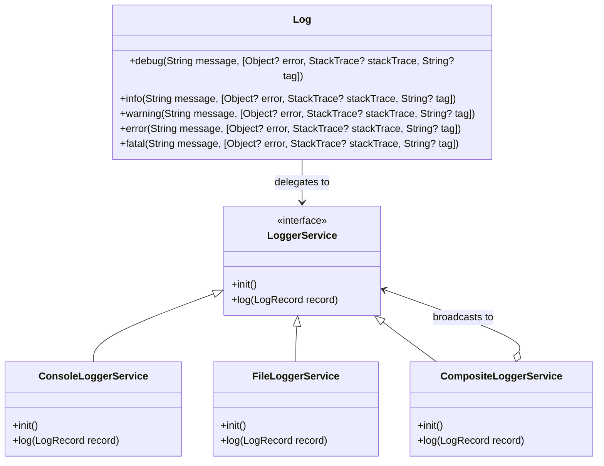

# Logging & Diagnostics Manual

This manual documents the structure, configuration, usage, and diagnostic discovery of the logging framework implemented in Label Grid.

---

## 🏛️ Architecture & Design

Label Grid implements a modular, SOLID-compliant logging architecture that decouples log collection from output storage. 



### Core Components
- **`Log`** ([logger_service.dart](file:///g:/GitHub/stickify/lib/core/services/logging/logger_service.dart)): The global static entry point. Filters logs based on the current minimum severity level (`minLevel`) before passing them to the active `LoggerService`.
- **`ConsoleLoggerService`** ([console_logger_service.dart](file:///g:/GitHub/stickify/lib/core/services/logging/console_logger_service.dart)): Dispatches formatted messages to the developer console via Dart’s standard `developer.log`.
- **`FileLoggerService`** ([file_logger_service.dart](file:///g:/GitHub/stickify/lib/core/services/logging/file_logger_service.dart)): Persists log records locally on disk with automated log rotation and storage caps.
- **`CompositeLoggerService`** ([composite_logger_service.dart](file:///g:/GitHub/stickify/lib/core/services/logging/composite_logger_service.dart)): Implements the composite pattern to broadcast log events to multiple downstream services simultaneously.

---

## ⚙️ Configuration & Environments

Logging rules differ depending on the targeted runtime flavor:

| Environment | Flavor | Min Severity | Targets | Description |
|---|---|---|---|---|
| **Development** | `development` | `LogLevel.debug` | Console | Detailed trace logging for local step debugging. |
| **Staging** | `staging` | `LogLevel.info` | Console + Local File | General flow logs, persistent local files, and full error details. |
| **Production** | `production` | `LogLevel.info` | Console + Local File | General flow logs, persistent local files, and full error details. |

Initialization and logging targets are configured in `lib/main_development.dart`, `lib/main_staging.dart`, and `lib/main_production.dart` during the bootstrap startup phase.

---

## 🛠️ Logging API Usage

To log a message, import the barrel logging file and use the appropriate severity level:

```dart
import 'package:stickify/core/services/logging/logger_service.dart';

// Debug trace logging (omitted in production)
Log.debug('User selected print slot index: $index', tag: 'UI');

// Informative flow event
Log.info('Successful print spool request finalized.');

// Recoverable anomaly warning
Log.warning('Printer returned buffer busy state; retrying spooling...', tag: 'Printing');

// Error logging with exceptions & stack traces
try {
  parseMetadata(data);
} catch (e, stack) {
  Log.error('Failed to parse template metadata', error: e, stackTrace: stack);
}

// Critical/Fatal logs (crashes, system failures)
Log.fatal('Failed to read essential system printer configurations', error: e);
```

---

## 💥 Global Crash & Exception Interception

Label Grid automatically intercepts and records crashes/errors at runtime:
1. **Flutter Framework Errors**: Handled via `FlutterError.onError`, redirecting framework layout errors and widget crashes to `Log.fatal`.
2. **Uncaught Asynchronous Errors**: Handled via `PlatformDispatcher.instance.onError`, catching out-of-band asynchronous exceptions and routing them to `Log.fatal`.
3. **State Management Exceptions**: Handled via `AppBlocObserver` in the presentation layer, logging all cubit/bloc transitions and exceptions as `Log.error`.

---

## 🔍 Locating Log Files in Production Releases

When a production app is compiled and distributed, log files are stored in the platform's standard application support directory.

The current active log is saved as **`app.log`**.

### Log Rotation (Disk Preservation)
To prevent logs from consuming infinite storage space, the file logger enforces:
- **Daily Rolling**: If the date changes, the file is rolled.
- **Size Rolling**: If `app.log` reaches **5 MB**, it rolls over.
- **Max Backups Capping**: Keeps up to 5 historical log backups.
  - Current logs: `app.log`
  - Backup history: `app_1.log` (most recent), `app_2.log` ... up to `app_5.log` (oldest).

### Platform Paths

#### 🪟 Windows
In Windows production builds, logs are stored in standard Roaming AppData directory matching the company name (`Inevitable Software Company`) and product binary name (`stickify`):
- **Path**: `C:\Users\<username>\AppData\Roaming\Inevitable Software Company\stickify\app.log`
- **Shortcut**: Press `Win + R`, paste `%APPDATA%\Inevitable Software Company\stickify`, and press `Enter`.

#### 🍏 macOS
On macOS builds, logs are saved to the bundle application support directory:
- **Path**: `~/Library/Application Support/Inevitable Software Company/stickify/app.log` (or matches bundle identifier like `~/Library/Application Support/com.example.stickify/app.log`).

#### 🐧 Linux
On Linux distributions, files reside in standard user local share directories:
- **Path**: `~/.local/share/stickify/app.log`

#### 🤖 Android
Stored inside the app's secure internal storage files directory:
- **Path**: `/data/data/<package_name>/files/app.log` (requires root access or file exporter utility to view).

#### 📱 iOS
Located in the private App Container Application Support folder:
- **Path**: `Documents/app.log` or `Library/Application Support/app.log` inside the sandboxed container.
